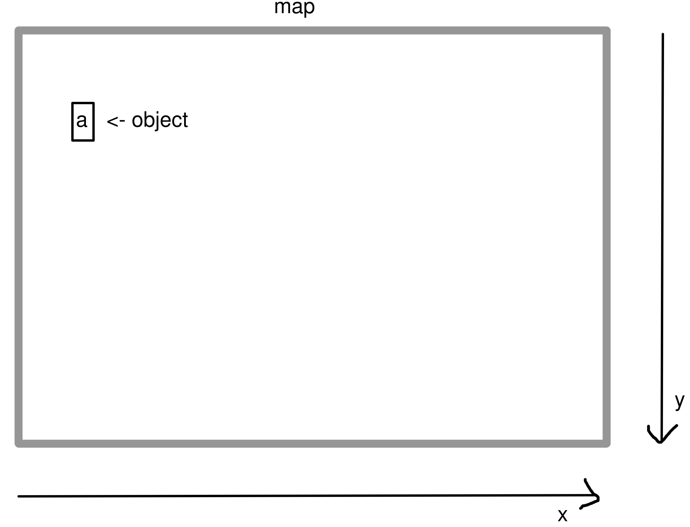

# Scrap_engine documentation
## Concept
The basic concept of scrap_engine evolves around having a ```map``` that is basicaly a cordinatesystem that represents the colloms and rows in the console/terminal.
On this maps ```objects``` can be added, moved, and removed acording to given rules.

## Classes
### scrap_engine.Map
The basic map class to add scrap_engine.objects on.
#### Methods:
#### scrap_engine.Map.__init__(self, height=height-1, width=width, background="#", dynfps=True)
Constructor.
#### Args:
- height:```int``` Heigt of the map
- width:```int``` Width of the map
- background:```String``` Default char, that will be used as the maps background
- dynfps:```boolean``` If changes of the map will be checked a ```scrap_engine.Map.show()```

#### scrap_engine.Map.show(self, init=False)
Shows a frame.
#### Args:
- init:```boolean``` Forces printing

#### scrap_engine.Map.resize(self, height, width, background="#")
Resizes the map.
#### Args:
- height:```int``` New heigt of the map
- width:```int``` New width of the map
- background:```String``` Default char, that will be used as the maps background

#### scrap_engine.Mapblur_in(self, blurmap, esccode="\033[37m")
Blurs another map as the background into the map
#### Args:
- blurmap:```scrap_engine.Map``` The map to use as the background
- esccode:```String``` Escape code used to blur the blurmap
---

### scrap_engine.Object
An object that can be added and moved on a ```scrap_engine.Map```.
#### Methods:
#### scrap_engine.Object.__init__(self, char, state="solid", arg_proto={})
Constructor.
#### Args:
- char:```String``` A string that represents to object on the map
- state:```String``` State ```"solid"``` or ```"float"```, that indices the behavior of the Obeject. ```"solid"``` means that not other objects can be put over the object, ```"float"``` means that it is possible.
- arg_proto:```dictionary``` A custom dictionary that can be passed to custom objects in, for example ```scrap_engine.Text```

#### scrap_engine.Object.add(self, map, x, y)
Adds the object to a given map at a given coordinate.
#### Args:
- map:```scrap_engine.Map``` The map the object should be added to
- x:```int``` The x coordinate the object will be set to
- y:```int``` The y coordinate the object will be set to

#### scrap_engine.Object.set(self, x, y)
Sets the object to a given coordinate on the map.
If this fails, the method will return 1.
#### Args:
- x:```int``` The new x coordinate the object will be set to
- y:```int``` The new y coordinate the object will be set to

#### scrap_engine.Object.remove()
Removes the object from the map.

#### scrap_engine.Object.redraw()
Redraws the object on the map.

#### scrap_engine.Object.rechar(self, char)
Changes the char of the Object, that represents the object on the map.
#### Args:
- char:```String``` The new string that represents to object on the map
